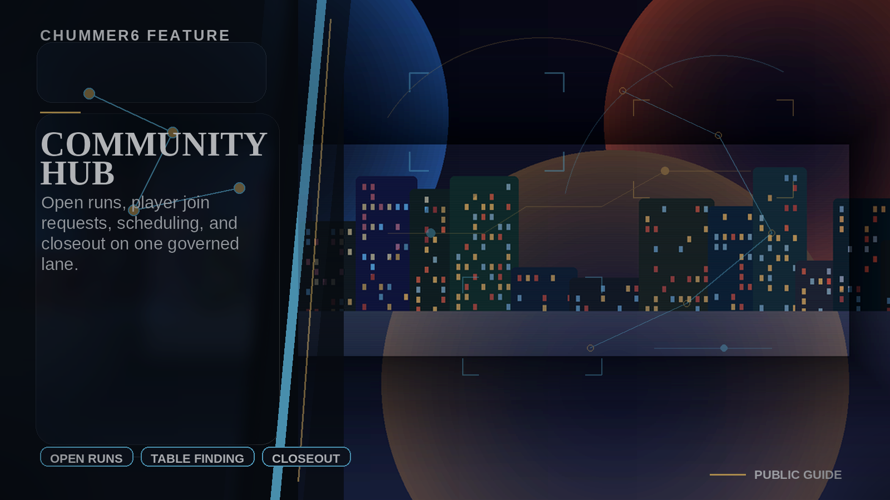

# Community Hub

Find a run, see the rules, get scheduled cleanly, and let the world remember the outcome.

## When this helps

Use this when the hard part is no longer one legal character, but getting a real table together. The useful version is not a new social network; it is a cleaner path from open run to accepted players, scheduling, table expectations, and closeout.

A GM should be able to publish a beginner-friendly run and see who fits before the evening dissolves into chat archaeology.

## The table problem

Finding a table still means juggling community rules, approvals, chats, calendars, and follow-up by hand.

For example, chummer becomes the structured layer above community chats, calendars, and play surfaces instead of another disconnected app.

## Can I use it?

Parts of this already exist after sign-in, but I would still treat the larger idea as work in progress. The next useful work is depth: steadier examples, better media, and cleaner handoff back into normal character tools.
