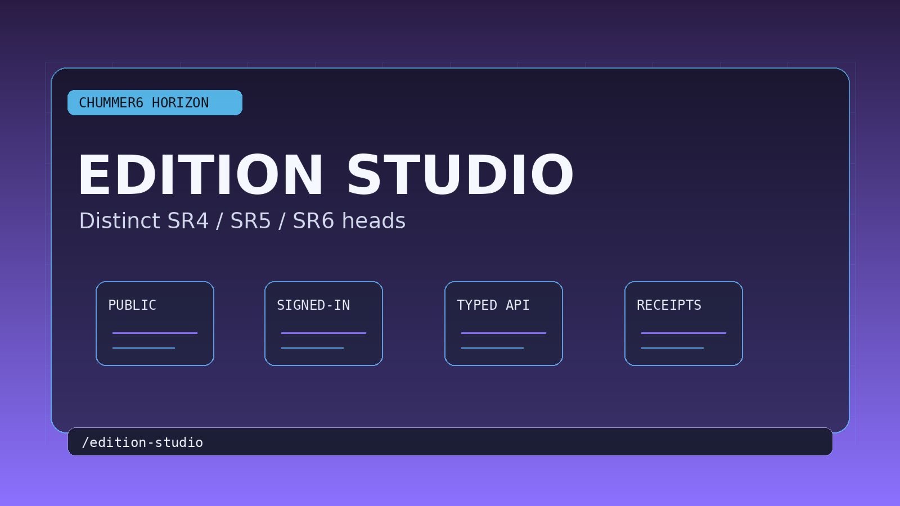

# Edition Studio

Distinct SR4, SR5, and SR6 ruleset heads without splitting the product into disconnected apps.

## When this helps

This belongs in the background until it earns a clearer user-facing shape. The useful promise is simple: SR4, SR5, and SR6 should feel deliberately different without splitting Chummer into three unrelated apps.

Most visitors do not need to care about it yet.

## The table problem

Multiple rulesets can share one shell while still losing the mental-model differences that make them understandable.

For example, sR4, SR5, and SR6 keep distinct handling in one product instead of flattening into generic chrome.

## Can I use it?

Parts of this already exist after sign-in, but I would still treat the larger idea as work in progress. The next useful work is depth: steadier examples, better media, and cleaner handoff back into normal character tools.
