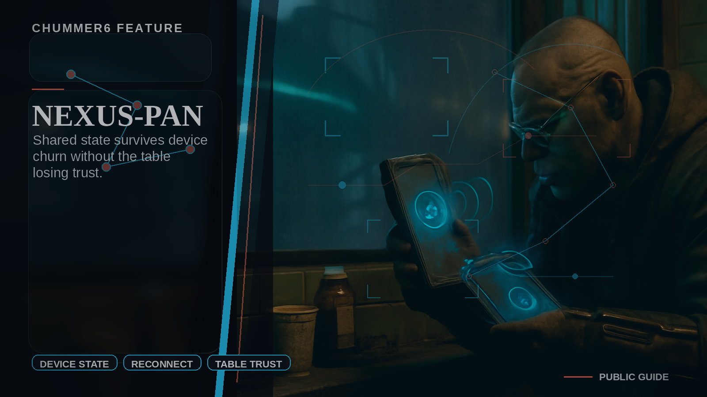

# NEXUS-PAN

Shared state survives device churn without the table losing trust.

## When this helps

Use NEXUS-PAN when the campaign has to survive real devices: a laptop sleeps, a phone reconnects, a tablet sees stale state, or a remote player returns mid-scene.

The point is not another named product shelf. The point is boringly reliable continuity, visible conflicts, and a calm way back into the session.

## The table problem

My devices drift and the table loses confidence.

For example, shared state survives device churn without the GM rebuilding the run from memory.

## Can I use it?

There is an early version you can try. It is real enough to learn from and still rough enough that feedback matters. The next useful work is depth: steadier examples, better media, and cleaner handoff back into normal character tools.
