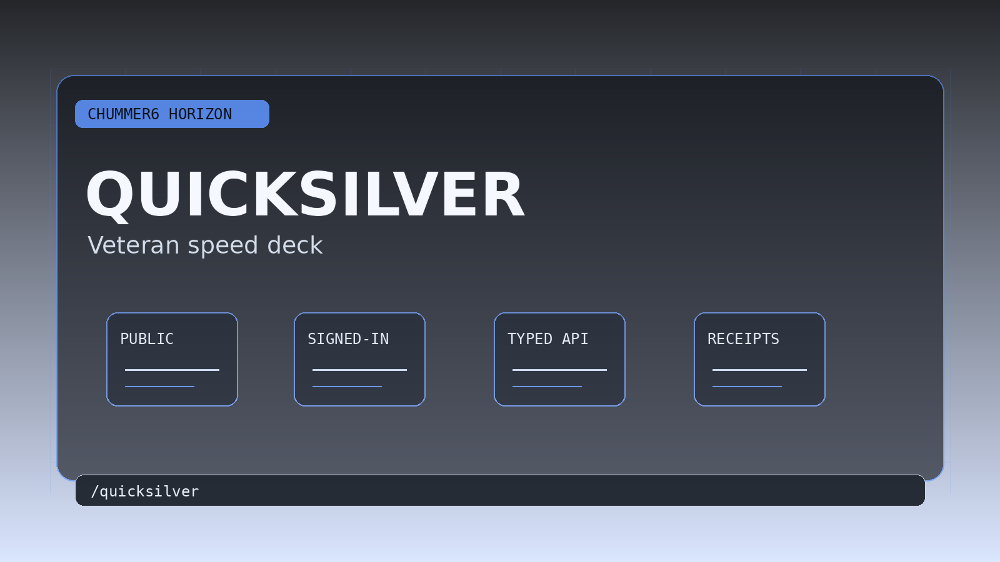

# Quicksilver

Expert-speed jumps across builds, rules, prep, and publication desks without leaving Chummer.

## When this helps

This is speed work for people who already know where they are going. It should shorten the path between build review, rules lookup, prep, and publication without hiding what happened.

Fast is only useful here if it stays understandable.

## The table problem

Expert users still lose tempo when trusted pages are real but too many clicks apart.

For example, the next safe jump stays fast without flattening legality, explainability, or ownership.

## Can I use it?

Parts of this already exist after sign-in, but I would still treat the larger idea as work in progress. The next useful work is depth: steadier examples, better media, and cleaner handoff back into normal character tools.
