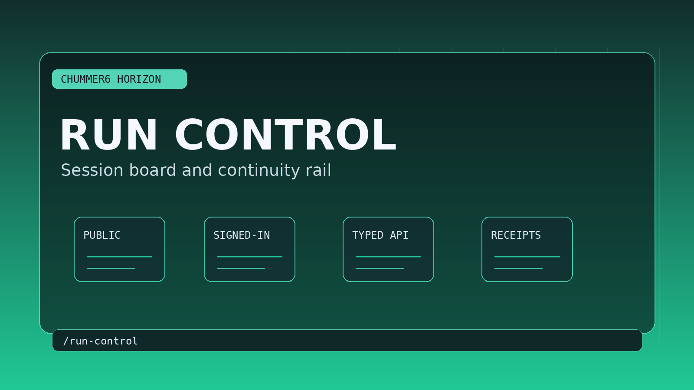

# Run Control

GM operations, active-scene continuity, and recap return in one Chummer workspace.

## When this helps

This is the GM's session cockpit idea, but it should not become another named shelf unless it clearly beats notes, chat, and memory during an actual run.

The bar is simple: a GM should see the current scene, the next safe action, and the recovery point without hunting.

## The table problem

GMs still stitch session control together from notes, memory, and chat when the operations page is not inside Chummer.

For example, the current run, continuity, and next safe action stay visible inside Chummer.

## Can I use it?

Parts of this already exist after sign-in, but I would still treat the larger idea as work in progress. The next useful work is depth: steadier examples, better media, and cleaner handoff back into normal character tools.
