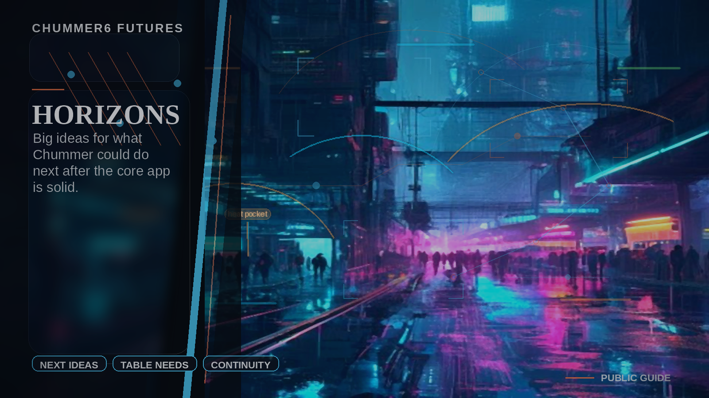

# Campaign tools

Use this index when you want the larger campaign picture: living-world tools, dossiers, table control, publishing, and long-term ideas around the character builder.
Some pages describe early slices that already exist. Others are future-facing. Start with the current status when you need the exact availability picture.

- [NEXUS-PAN](nexus-pan.md)
- [ALICE](alice.md)
- [ORIGIN DOSSIER](origin-dossier.md)
- [KARMA FORGE](karma-forge.md)
- [JACKPOINT](jackpoint.md)
- [RUNSITE](runsite.md)
- [RUNBOOK PRESS](runbook-press.md)
- [GHOSTWIRE](ghostwire.md)
- [TABLE PULSE](table-pulse.md)
- [RUN CONTROL](run-control.md)
- [EDITION STUDIO](edition-studio.md)
- [LOCAL CO-PROCESSOR](local-co-processor.md)
- [QUICKSILVER](quicksilver.md)
- [COMMUNITY HUB](community-hub.md)
