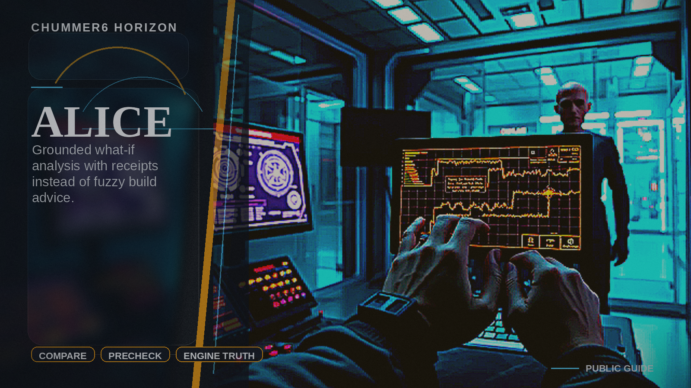

# ALICE

Builders get grounded what-if analysis without trusting fuzzy assistants.

## Why this matters

We only discover weak builds after they explode in public.

Picture the scene: A player compares two builds and sees grounded tradeoffs with receipts instead of vibe-based suggestions.

## Build path

- Today: horizon.
- Next: bounded research.

## Table pain

Players often discover bad builds, illegal interactions, or weak upgrade paths only after the run has already gone sideways.

## Bounded product move

Chummer would provide grounded comparative analysis, preflight quality checks, and guided build insight that stay tied to deterministic engine truth.

## Foundations

* explain surfaces
* deterministic runtime DTOs
* workbench compare flows

## Why still a horizon

The product still needs authoritative explain and comparison seams before it can safely add higher-level advisory analysis.
