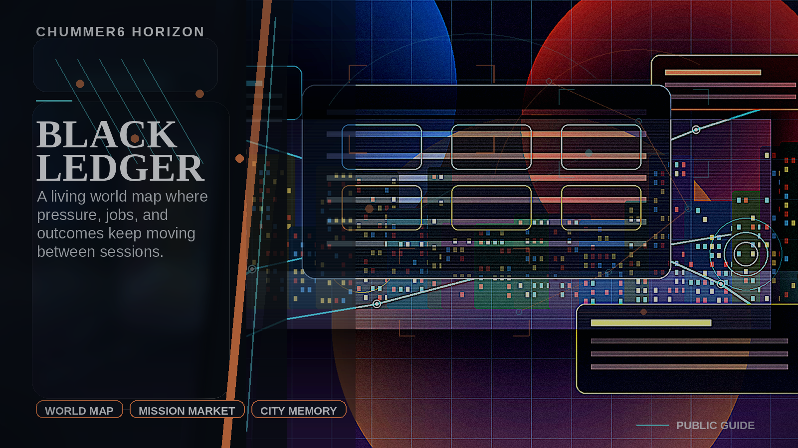

# BLACK LEDGER

The world gives the GM a live job board, practical prep hooks, and a visible memory of what the table changed.

## Why this matters

I want the city to matter between sessions without needing a metagame spreadsheet to prep the next run.

Picture the scene: A GM opens Seattle, sees which districts are hot, picks a job with grounded opposition and consequences, runs it, and later watches the map remember the fallout.

## Current stage

- Today: Future concept.
- Next: Research and prototypes.

## The problem

Campaigns can feel sealed off from each other, the city rarely pushes back on its own, and GMs often have to invent heat, corp agendas, district pressure, opposition, and fresh jobs from nothing between sessions.

## What it would do

BLACK LEDGER would add a governed world map and mission-market layer above the campaign spine. District pressure, reviewed intel, faction projects, and completed runs would feed a living GM job board, planned and completed run markers, practical prep hooks, and player-safe city news without taking campaign authority away from the GM.

The public fantasy is:

> The city keeps scheming between sessions, and every run changes who owns tomorrow.

## What has to be true first

* campaign truth and world truth stay separate, with the GM still deciding what becomes real for one table
* world-linked offers, pressure, and consequences stay receipt-backed instead of becoming invisible simulation drift
* organizer, GM, curator, and later faction-seat authority are clearly separated
* scheduling, resolution, and publication outputs never outrank run truth or leak private state
* player-safe city news can be published without letting synthesis or media lanes become canonical truth

## Why it is not ready yet

This only works if Chummer can prove three things at once:
1. campaigns stay the center of play instead of becoming subordinate to a metagame,
2. world-linked pressure, jobs, prep hooks, and rewards stay inspectable through receipts and approvals,
3. organizer, GM, and future manager-player authority are separated cleanly enough that the city feels alive without becoming arbitrary.

The first proof gate should be a deliberately small vertical slice rather than a full simulation:

> A GM can open the map, understand why a job exists, get usable prep from it, schedule it, report the result, and watch the world change.

That first proof is not a giant faction simulator.
It is one city, one tick, one adopted job, one scheduled session, one reported outcome, and one visible consequence.

Until those boundaries are trustworthy, BLACK LEDGER should stay a horizon rather than a shipment promise.
