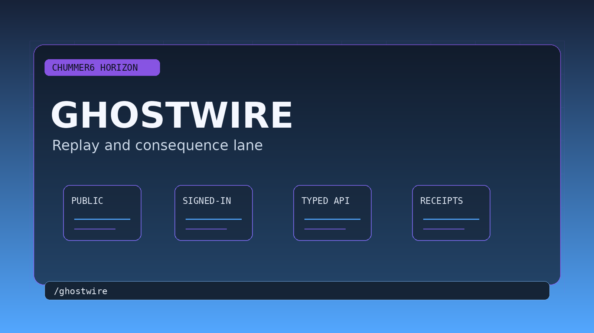

# GHOSTWIRE

Tables can replay, inspect, and compare what happened without forking durable session truth.



## Why this matters

We know something went wrong, but we cannot reconstruct what actually happened.

Picture the scene: A GM replays a contested combat turn, sees receipts over time, and generates a grounded after-action recap.


## Current stage

- Today: A bounded first playable slice is live.
- Next: flagship depth hardening.

**GHOSTWIRE is Chummer’s replay and after-action forensics horizon: the future where the table can reconstruct what happened, compare outcomes, and generate grounded after-action packets without rewriting history.**

Things go wrong.

A disputed combat turn.
A reconnect failure.
A rules confusion.
A player asks why a value changed.
The GM needs to know whether the session state is still trustworthy.

GHOSTWIRE exists for that moment.

## The promise

**When something matters, Chummer can show what happened.**

GHOSTWIRE uses receipts over time:

- event logs
- reducer-safe state changes
- explain packets
- reconnect receipts
- crash/recovery markers
- campaign ledger entries
- media receipts where available

It can reconstruct:

- timeline
- key changes
- contested moments
- before/after values
- safe state
- uncertain state
- what-if comparisons
- after-action reports

Without mutating canonical truth.

## What it feels like

A GM asks:

> “Why did this runner’s defense pool change?”

GHOSTWIRE shows:

```text
Timeline:
19:41 — rule environment unchanged
19:43 — rule triggered
19:44 — gear wireless state toggled
19:46 — reconnect occurred
19:46 — local pending edit discarded
19:47 — current value recalculated

Reason:
Defense changed because condition and wireless state interacted.
Reconnect did not alter the value.
```

The table can stop guessing.

## What it should include

### Replay timeline

A timeline of meaningful events:

- state change
- receipt
- conflict
- reconnect
- rule-environment change
- GM override
- support/crash event
- run resolution
- campaign/world consequence

### After-action report

A report that can show:

- what happened
- what changed
- what remains uncertain
- what was discarded
- what needs review
- what can be safely shared

### What-if comparison

Compare:

- before and after state
- alternate legal path
- different rule environment
- rollback candidate
- failed vs successful outcome

### Recovery memory

When Chummer crashes or reconnects:

- what was saved
- what was pending
- what is trustworthy
- what needs review
- next safe action exists

### Media artifacts

Optional:

- replay card
- after-action PDF
- narrated summary
- support evidence packet
- share-safe recap

## What users want to know

### Is this recording my game?

No. GHOSTWIRE is about receipt-backed Chummer state. Session media belongs to Table Pulse and requires consent.

### Can it settle rules arguments?

It can show what Chummer did and why. It does not replace the GM’s table authority.

### Can it help support?

Yes. It can produce better evidence packets.

### Can it create recaps?

Yes, but with source-backed events and approval.

### Can it change the past?

No. It reconstructs. It does not rewrite.

## What it is not

GHOSTWIRE is not:

- surveillance
- secret recording
- retroactive rule mutation
- GM override without trace
- invented recap
- VTT replay
- player discipline tool

It is forensics with receipts.

## The first slice

The first slice should be:

**After-action receipt packet for a disputed value**

It should show:

1. value before
2. events that changed it
3. receipts
4. current truth
5. uncertain/degraded state if any
6. share-safe report

Success looks like:

> A GM can answer “what happened?” without reconstructing the session from memory.

## The vision

Trust breaks when nobody can reconstruct the moment.

**GHOSTWIRE is where Chummer remembers the chain of events well enough to explain, recover, and move forward.**
