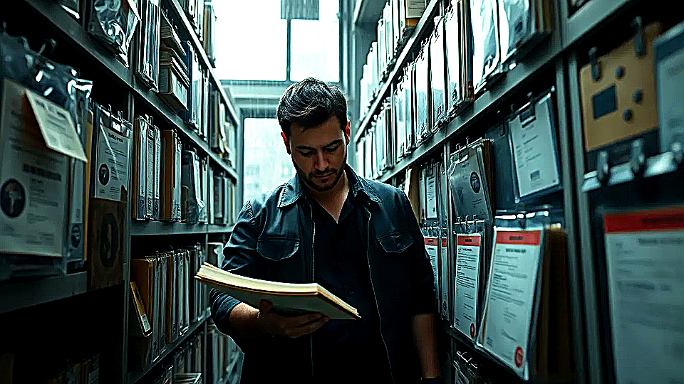

# JACKPOINT

- id: jackpoint
- pain_label: I want dossiers, recaps, and briefings that feel good without making things up.
- wow_promise: The table gets grounded short-to-medium-form artifacts that feel finished without severing provenance.
- table_scene: After a run, the GM exports a dossier-plus-recap packet with narration, evidence rooms, and share-safe previews.

## Build path

- intent: eventual_product_lane
- current_state: horizon
- next_state: bounded_research

## Registry posture

- owning_repo: chummer6-hub
- owning_repo: chummer6-hub-registry
- owning_repo: chummer6-media-factory
- promoted_tools: MarkupGo, Soundmadeseen, PeekShot, Documentation.AI
- bounded_tools: Unmixr AI, Mootion, Paperguide, First Book ai

## Canon source

`products/chummer/horizons/jackpoint.md`

## Table pain

Players and GMs want dossiers, recaps, primers, and narrated briefings, but most content tools invent details and sever the link back to grounded evidence.

## Bounded product move

JACKPOINT is the artifact-studio horizon.
It covers dossier packets, recap artifacts, narrated briefings, evidence rooms, share cards, and creator packs as bounded outputs tied to Chummer-owned manifests and receipts.
JACKPOINT is intentionally the short-to-medium-form studio lane.
It does not replace RUNBOOK PRESS long-form publishing.

## Likely owners

* `chummer6-hub`
* `chummer6-hub-registry`
* `chummer6-media-factory`

## Key tool posture

* `MarkupGo` - document/render adapter lane
* `Soundmadeseen` - narrated recap and briefing media lane
* `Unmixr AI` - candidate voice lane until proven
* `PeekShot` - preview/share-card adapter
* `Documentation.AI` - downstream docs/help projection
* `Paperguide` - cited grounding helper
* `Mootion` - bounded video support
* `First Book ai` - bounded overflow support when the artifact lane needs long-form carryover

## Foundations

* grounded evidence receipts
* approval states
* registry/media seam clarity
* source classification
* bounded publication workflows

## Why still a horizon

The artifacts are valuable only if provenance survives formatting, narration, preview generation, and publication.
Until that chain is reliable, Chummer should not pretend the studio is ready.
