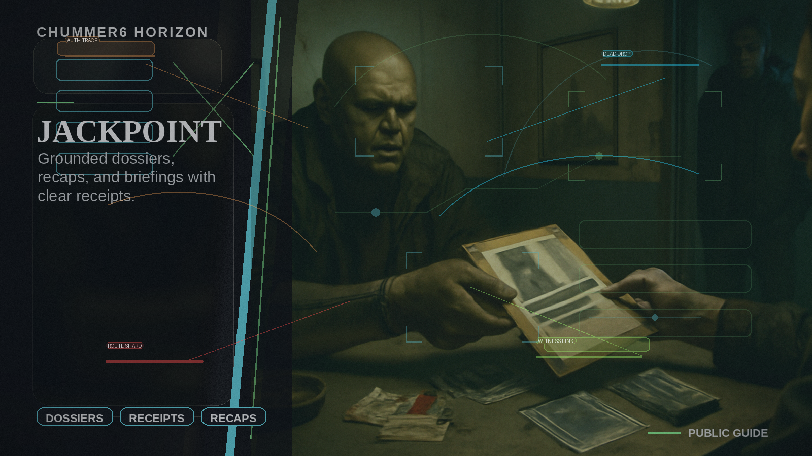

# JACKPOINT

The table gets polished short-to-medium-form dossiers, recaps, and briefings that still show where the facts came from.

## Why this matters

I want dossiers, recaps, and briefings that feel good without making things up.

For example: After a run, the GM exports a dossier-plus-recap packet with narration, evidence rooms, and share-safe previews.

## Can I use it now?

Works after sign-in.

Next: Make it deeper without loosening the boundaries.

## Explanation video

[Watch the JACKPOINT 90-second deep dive](https://chummer.run/media/horizons/jackpoint-90s-deepdive.mp4). [Captions](https://chummer.run/media/horizons/jackpoint-90s-deepdive.vtt).
