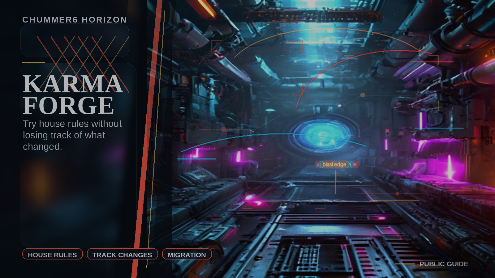

# Karma Forge

Tables can evolve house rules without splintering into unreadable forks.

## When this helps

Use this when house rules stop being a private note and start affecting the table. A good rule change should show what changed, who agreed to it, and how to undo it if it makes the game worse.

This is for tables that want flexibility without custom-rule soup.

## The table problem

I want house rules without fork chaos.

For example, a GM shares a house-rule set with visible impact, approval history, and a clear way back if it breaks the game.

## Can I use it?

There is an early version you can try. It is real enough to learn from and still rough enough that feedback matters. The next useful work is clearer controls, better fit for real tables, and fewer edge-case surprises.

## Explanation video

[Watch the KARMA FORGE 90-second deep dive](https://chummer.run/media/horizons/karma-forge-90s-deepdive.mp4). [Captions](https://chummer.run/media/horizons/karma-forge-90s-deepdive.vtt).
