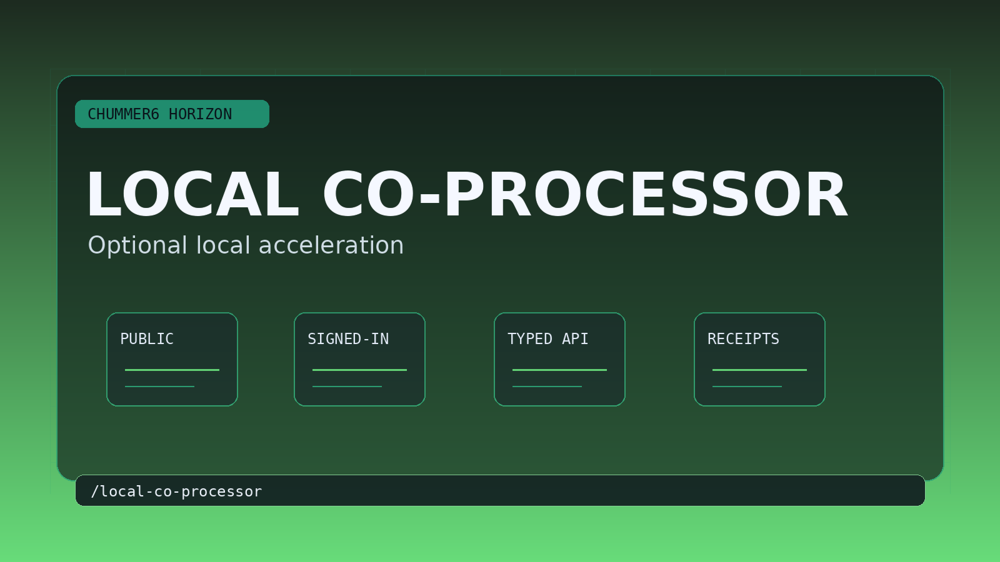

# LOCAL CO-PROCESSOR

Local acceleration improves privacy and responsiveness where available without becoming mandatory infrastructure.

## Why this matters

Some tasks would be cheaper or faster locally, but the product cannot assume local compute exists.

Picture the scene: A creator with a strong local machine opts into accelerated explain or media assistance while the same workflow still works hosted-only for everyone else.

## Current stage

- Today: You can try the first real slice today.
- Next: Make the slice richer, steadier, and easier to trust.

## The problem

Some explain, search, and media-assist workloads would be cheaper, faster, or more private with optional local acceleration, but the product cannot require every user to run local compute.

## What has to be true first

* portable deterministic engine host strategy
* hosted-first parity
* explicit non-mandatory local runtime policy
* disableable local acceleration paths
