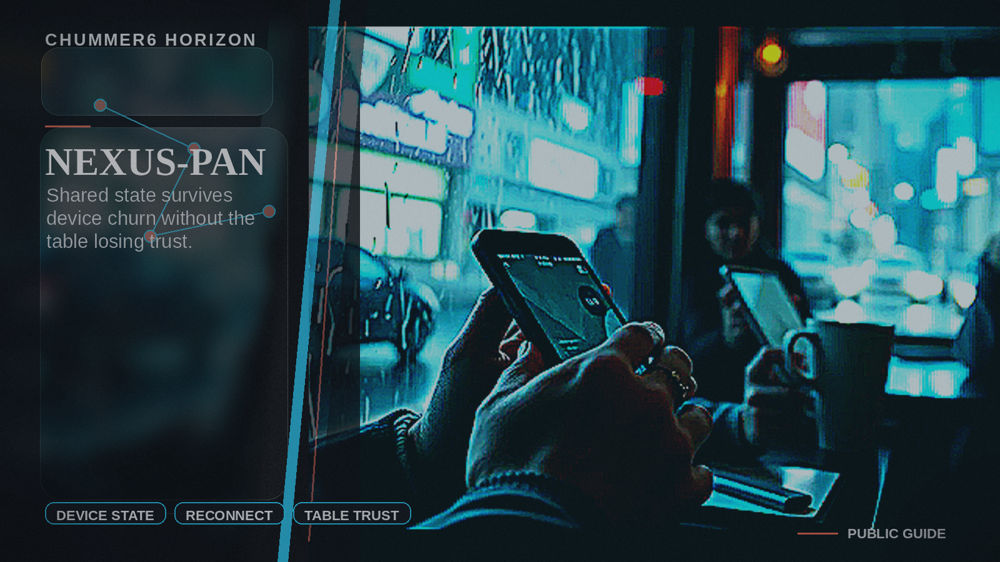

# NEXUS-PAN

Shared state survives device churn without the table losing trust.

## Why this matters

My devices drift and the table loses confidence.

Picture the scene: A player reconnects mid-session and catches up without the GM reconstructing state by memory.

## Build path

- Today: horizon.
- Next: bounded research.

## Table pain

Tables lose confidence when devices, PAN state, and cross-actor continuity drift during live play.

## Bounded product move

Chummer would expose grounded device and shared-state continuity support without inventing new rules truth outside the engine and play contracts.

## Foundations

* session semantics
* runtime bundles
* explain provenance
* play-shell reliability

## Why still a horizon

The active release path is still finishing durable session and runtime seams.
Until those seams are fully trustworthy, a richer PAN layer would widen unstable boundaries.
