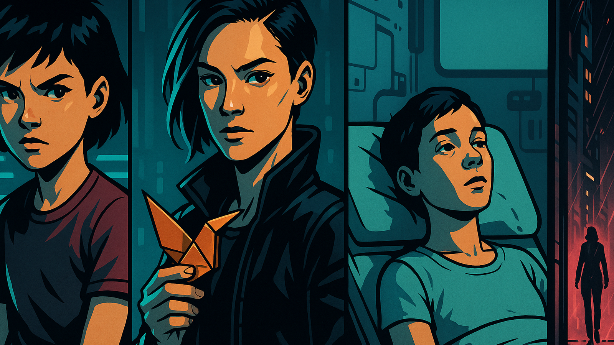

# Origin Dossier

The player gets an accepted origin story, portraits, narration, and later ALICE context without letting backstory prose rewrite the sheet.

## Why this matters

A runner can start as math before they feel like a person.

Picture the scene: A player drafts a troll decker, the GM adds a clinic-favor constraint, and Chummer turns the approved origin into a dossier bundle that ALICE can use later.

## Current stage

- Today: shipped mvp.
- Next: flagship depth hardening.

## When this helps

Open Origin Dossier when a legal sheet still feels unfinished as a person.

It is for the moment after the numbers work, but the table still needs to know why this runner exists, what they owe, who knows them, and what pressure follows them into the first job.

Origin Dossier can turn reviewed runner context into contacts, debts, enemies, scars, secrets, portraits, narration, and a short player-facing identity package.

The player gets the final say on personal history.
The GM approves anything that changes campaign context.
The story must never rewrite the sheet.

## What it can become

For now, the accepted origin can become a private audiobook for that runner, linked through an EA-issued player link instead of a global Audiobookshelf login.

That matters because origin material is personal.
It may include family, debts, enemies, and private campaign pressure.
The player should be able to enjoy the finished story without exposing a shared media library or giving the desktop app broad media access.

## What it must not do

Origin Dossier may help decide who the character is.
It may not decide what the character owns, what qualities they have, what exceptions they receive, or what the rules engine accepts.

The story can suggest:

- this friend might become a contact
- this old debt might become a future hook
- this fear might shape roleplay
- this scene might make a good portrait or video prompt

The user still approves it.
The GM still approves campaign effects.
The character sheet changes only through normal Chummer edits.

## Can I use it?

There is an early version you can try.

Treat it as a guided origin and media preview, not as a finished book studio or automatic character author.
