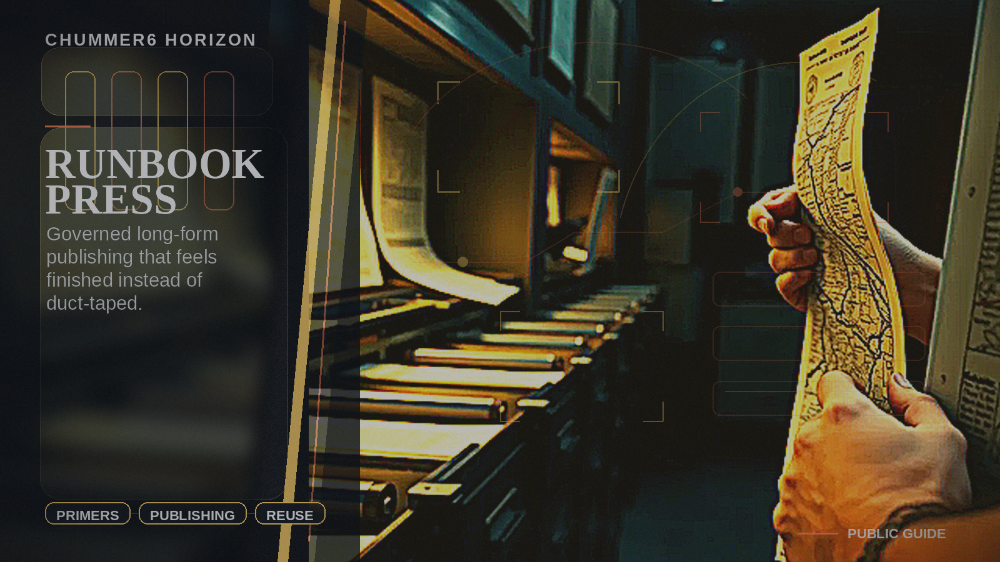

# RUNBOOK PRESS

Long-form publishing becomes something you can actually reuse instead of a ten-tool scramble.

## Why this matters

I want real primers, handbooks, and campaign books without duct-taping ten tools together.

For example: A creator turns approved Chummer material into a district guide or campaign book without juggling a pile of unrelated publishing tools.

## Can I use it now?

A first usable version works today.

Next: Make it richer, steadier, and easier to trust.

## Explanation video

[Watch the RUNBOOK PRESS 90-second deep dive](https://chummer.run/media/horizons/runbook-press-90s-deepdive.mp4). [Captions](https://chummer.run/media/horizons/runbook-press-90s-deepdive.vtt).
