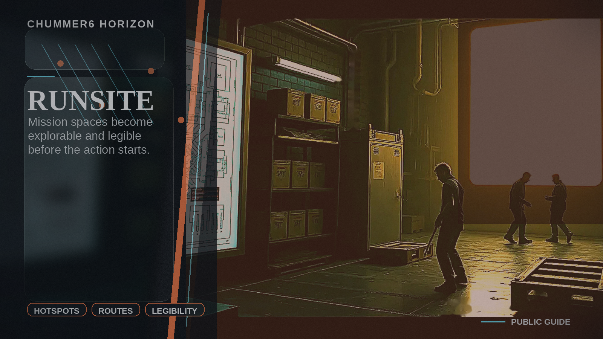

# RUNSITE

Mission spaces become explorable and legible before the action starts.



## Why this matters

My players still misread the space even after the briefing.

Picture the scene: A GM sends an explorable safehouse pack with hotspots, floor plans, route overlays, and optional narration before the session.


## Current stage

- Today: Future concept.
- Next: Research and prototypes.

**RUNSITE is Chummer’s spatial-prep horizon: the future where mission locations become explorable, understandable, and briefing-ready before the action starts.**

GMs describe spaces.
Players misread them.
A club, museum, warehouse, arcology floor, or black clinic can matter enormously, but the table often has no shared mental picture until confusion hits.

RUNSITE fixes that.

It helps the table understand the space before it starts.

## The promise

**Mission spaces should be readable before they become dangerous.**

RUNSITE can provide:

- explorable location packs
- floor-plan previews
- route overlays
- hotspots
- entry points
- security zones
- public/GM-only views
- optional narration
- presenter walkthroughs
- embedded context
- share-safe previews
- runsite cards

It is not live combat.
It is not a VTT replacement.
It is spatial briefing and planning.

## What it feels like

A GM prepares a run at a black clinic.

RUNSITE generates a pack:

```text
Player-safe view:
- front entrance
- public waiting area
- staff wing rumors
- loading dock
- known security cameras

GM-only view:
- hidden elevator
- astral ward zone
- drone nest
- emergency extraction tunnel
- prototype storage
```

Players can explore the briefing version.

The GM can keep secrets hidden.

The session starts with everyone understanding the space.

## What it should include

### Explorable packs

Location packets for:

- safehouses
- clinics
- clubs
- hotels
- arcologies
- warehouses
- labs
- museums
- docks
- corporate offices
- magical sites

### Route overlays

Show:

- likely approaches
- escape routes
- choke points
- public routes
- high-risk routes
- faction-controlled zones
- heat zones

### Hotspots

Clickable points:

- camera
- guard post
- locked door
- hidden egress
- public clue
- secret
- objective
- extraction route

### Permissioned views

Every runsite should support:

- player-safe
- GM-only
- faction-secret
- public teaser
- post-run reveal

### Media integration

Use:

- Crezlo Tours for explorable tours
- AvoMap for route and location context
- PeekShot for preview cards
- vidBoard for orientation host clips
- Soundmadeseen for optional narration

## What users want to know

### Is this a tactical map?

No. It is prep and spatial understanding. Tactical play can still happen in a VTT.

### Can the GM hide secrets?

Yes. Visibility tiers are mandatory.

### Can players explore before the session?

Yes, if the GM publishes a player-safe version.

### Can it connect to BLACK LEDGER?

Yes. A world map marker can point to a runsite packet.

### Can creators publish runsites?

Eventually, yes. RUNSITE packs are a natural creator artifact.

## What it is not

RUNSITE is not:

- a VTT replacement
- live combat truth
- token movement
- hidden world truth
- public leakage of GM-only space

It is a permissioned spatial artifact.

## The first slice

The first slice should be:

**Safehouse runsite packet**

It should include:

1. player-safe overview
2. GM-only overlay
3. hotspots
4. route preview
5. share card
6. source/approval receipt

Success looks like:

> A GM sends players a briefing pack, and the table starts the run with a shared mental map instead of ten minutes of confusion.

## The vision

The shadows have places.

Those places should matter.

**RUNSITE is where Chummer makes the spaces of a run legible, explorable, and memorable without taking over the table.**
