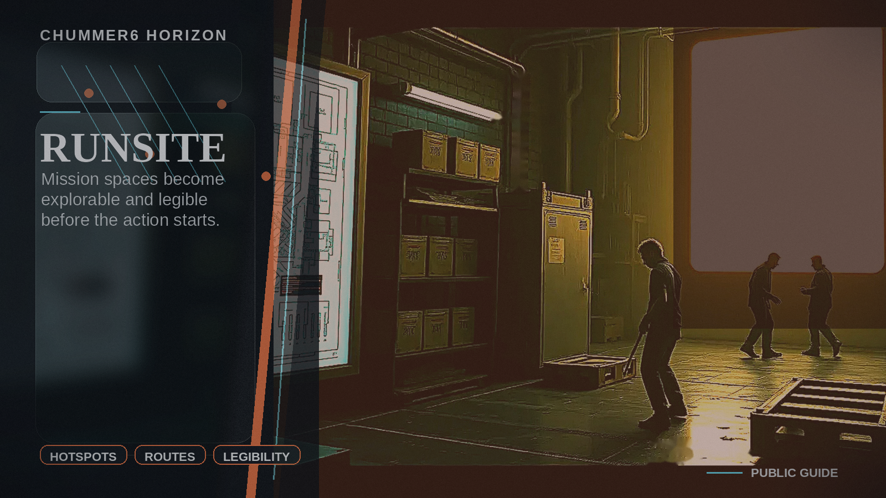

# RUNSITE

Guide fit: Expansion bet.

Mission spaces become explorable and legible before the action starts.

## Why this matters

My players still misread the space even after the briefing.

Picture the scene: A GM sends an explorable safehouse pack with hotspots, floor plans, route overlays, and optional narration before the session.

## Current stage

Today: Signed-in command lane is live.

Next: Make the coaching deeper without loosening the boundaries.

## Explanation video

[Watch the RUNSITE 90-second deep dive](https://chummer.run/media/horizons/runsite-90s-deepdive.mp4). [Captions](https://chummer.run/media/horizons/runsite-90s-deepdive.vtt).
