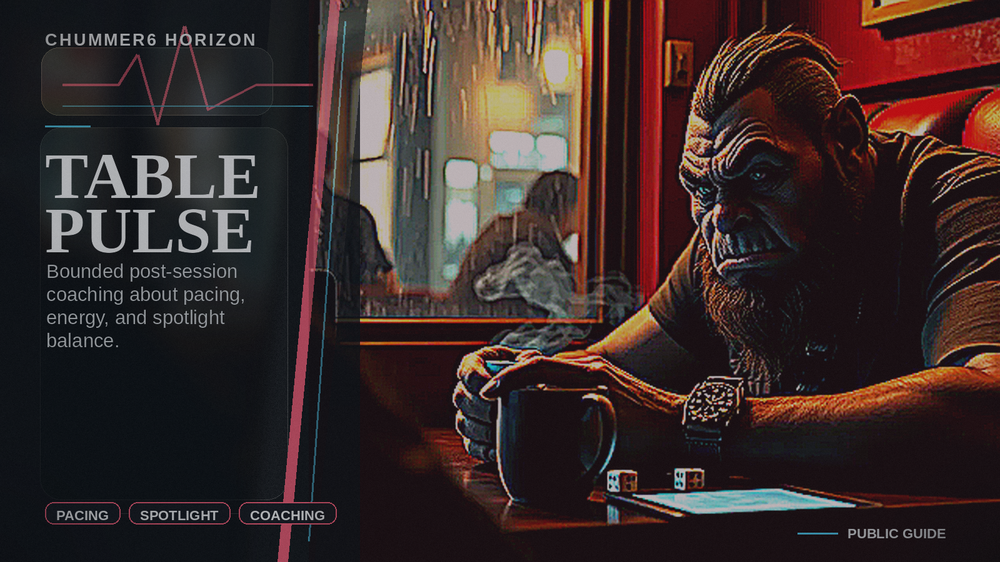

# TABLE PULSE

GMs get bounded post-session coaching about table dynamics without turning Chummer into live surveillance.

## Why this matters

I know the table drifted, but I cannot say where the energy, pacing, or spotlight balance broke.

Picture the scene: After an online session, the GM opens a coaching packet and sees spotlight balance, pacing heat zones, disengagement markers, and one or two concrete suggestions for the next run.

## Build path

- Today: horizon.
- Next: bounded research.

## Table pain

The GM knows something went off after a session, but cannot clearly reconstruct where pacing dragged, who lost the room, or which scene actually landed.

## Bounded product move

TABLE PULSE is the bounded GM coaching and table-dynamics horizon.
It turns recorded or uploaded session media into opt-in, post-session spotlight, pacing, engagement, and interruption diagnostics with optional narrated after-action guidance, without pretending to be live session truth.

## Foundations

* explicit consent and upload policy
* post-session-only analysis rules
* privacy and retention rules for coaching media
* bounded coaching artifact manifests
* replay and receipt references where available

## Why still a horizon

Coaching is only a win if it stays opt-in, post-session, private, and clearly separate from session truth or moderation.
Until Chummer can prove those consent, privacy, and artifact boundaries end to end, TABLE PULSE remains a horizon rather than live product behavior.
