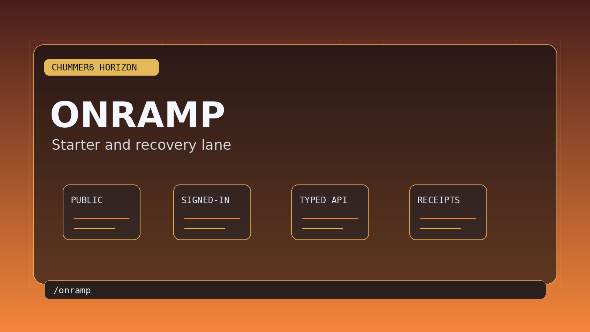

# Onramp





Onramp is Chummer's first-run and recovery path.

It is not a horizon. It is the route for people who are new, rusty, returning after a long break, or trying to get a table-ready runner without drowning in terminology.

## Reader Questions

### I am new. Where do I start?

Start with a guided starter workspace, not with the full parts map.

Onramp should help a new player answer:

- What kind of runner am I trying to play?
- What is the next safe choice?
- Why did Chummer warn me?
- What has to be fixed before this runner is table-ready?
- What can I ignore until later?

### I am a Chummer5a veteran. Why should I care?

Onramp should not patronize experienced users. It should give them a fast orientation path:

- where the real workbench is
- where legality and explanations live
- how recovery works
- what is preview-only today
- how to continue a runner instead of starting from scratch

### I am blocked. What now?

Onramp is also the calm recovery route. It should show the next useful action when setup, account linking, restore, or first-run state gets stuck.

## Public Routes

The current starter lane is anchored by:

- `/onramp`
- `/onramp/packets/starter_lane.md`
- `/onramp/packets/recovery_lane.md`
- `/account/onramp`
- `/account/onramp/open`
- `/account/onramp/starter`

Typed starter and recovery APIs exist for the signed-in path:

- `/api/v1/campaign-spine/me/onramp/dashboard`
- `/api/v1/campaign-spine/me/onramp/starter`
- `/api/v1/campaign-spine/me/onramp/recovery`

## Product Boundary

Onramp may guide, explain, and recover.

It must not:

- auto-build a character and hide the rules
- choose for the user without explanation
- invent legality guidance beyond Chummer-owned mechanics
- pretend every table conflict is solved
- trap expert users in beginner copy

## Good Onramp Copy

Good Onramp copy sounds like:

```text
You can start with a safe starter path, then open the full builder when you are ready.
```

```text
This warning matters now. These three choices can wait.
```

```text
Your runner is not table-ready yet because this availability conflict needs a GM decision.
```

Bad Onramp copy sounds like:

```text
A future guided-mastery concept will eventually...
```

```text
A provider suggests an optimized build.
```

```text
The system knows what you meant.
```

## What Makes It Feel Premium

- The first answer is always a next action, not a lecture.
- Veteran users can skip the guided path.
- New users see fewer choices, but never fake choices.
- Warnings explain what matters now.
- Recovery does not shame the user for being stuck.
- The path ends in the real Chummer workbench, not a tutorial island.

## Read Next

- [Download](DOWNLOAD.md)
- [Status](STATUS.md)
- [What Chummer6 Is](WHAT_CHUMMER6_IS.md)
- [Help](HELP.md)
