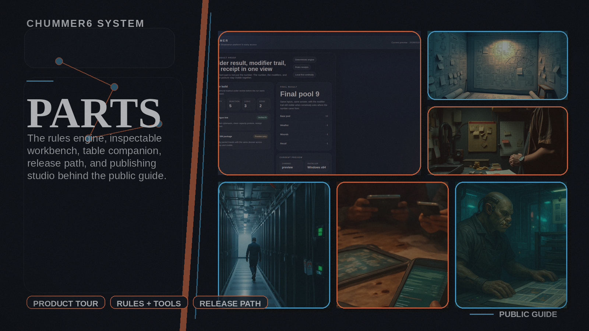

# Parts

Chummer6 is easier to understand when you break it into the product areas people actually touch.
Use this index when you want the map before you dive into one slice.

- [Design](design.md)
- [Core](core.md)
- [UI](ui.md)
- [Mobile](mobile.md)
- [Hub](hub.md)
- [UI Kit](ui-kit.md)
- [Hub Registry](hub-registry.md)
- [Media Factory](media-factory.md)
