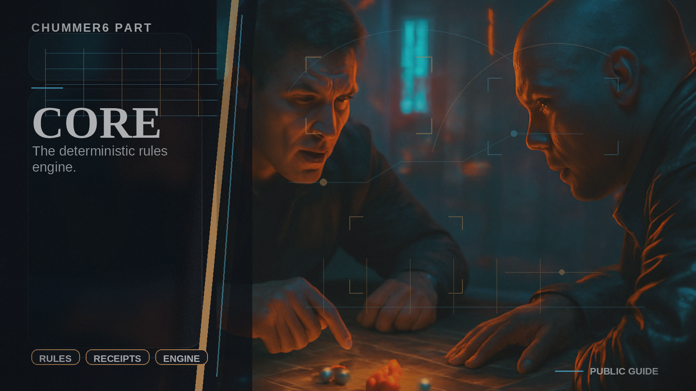

# Core

The deterministic rules engine.

## When you care

A number looks wrong, a modifier needs explaining, or you want proof instead of vibe-based tool behavior.

## Why you care

This is where Chummer earns trust. If the math cannot be reproduced and explained here, the rest of the product becomes expensive theater.

## What you notice

- reproducible rules outcomes
- readable receipts for why a pool or result changed
- a cleaner split between rules math and the extra features layered around it

## Current limits

- this is not the online account or update side
- this is not the table-side play view by itself

## Current state

Core already anchors the rules engine, and the current work is about keeping it strict enough that explain, play, and sync features can rely on it.

## Go deeper

- ../WHAT_CHUMMER6_IS.md
- ../WHERE_TO_GO_DEEPER.md
