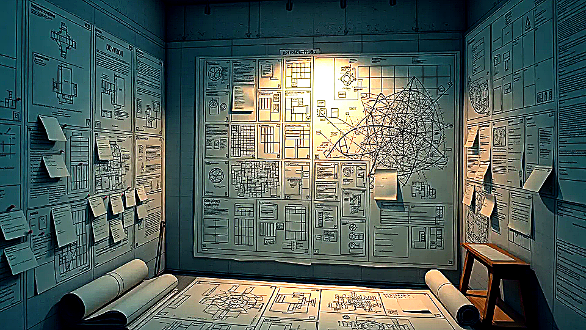

# Design

The long-range product map and decision filter.

## When you care

You want the bigger picture: what is already real, what is still coming, or where to click next after the front page.

## Why you care

It keeps the big story straight so the main pages, future ideas, and release notes do not contradict each other.

## What you notice

- clearer labels about what is real now, what is preview, and what is still future-facing
- a stable big-picture explanation before you dive into code or implementation detail
- one place that keeps the main pages and future ideas aligned

## Current limits

- you should not need this first for normal use
- it is the map, not the running software

## Current state

Design currently drives the public story, the roadmap pages, and the line between simple reader-facing pages and deeper technical material.

## Go deeper

- ../NOW/current-status.md
- ../WHERE_TO_GO_DEEPER.md
