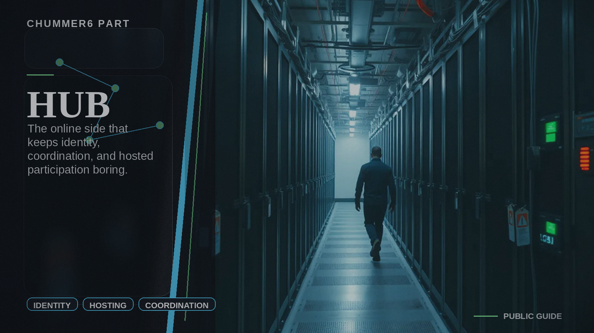

# Hub

The online side that keeps identity, coordination, and hosted participation boring.

## When you care

You sign in, sync a hosted surface, follow what is coming next, or use the public participation and recognition flows.

## Why you care

It keeps shared coordination, hosted surfaces, accounts, and community participation from turning into manual glue work.

## What you notice

- sign-in and account surfaces
- public landing, home, and participation entry points
- shared coordination, hosted status, and recognition views that do not ask you to understand the server internals first

## Current limits

- it is not where the rules math becomes true
- the user-facing coordination layer is promoted, but deeper operator seams still stay behind it

## Current state

Hub is already the hosted front door for identity, landing/home projection, participation, and community views, but it is still tightening the line between user-facing coordination and deeper operator machinery.

## Go deeper

- ../NOW/current-status.md
- ../WHERE_TO_GO_DEEPER.md
