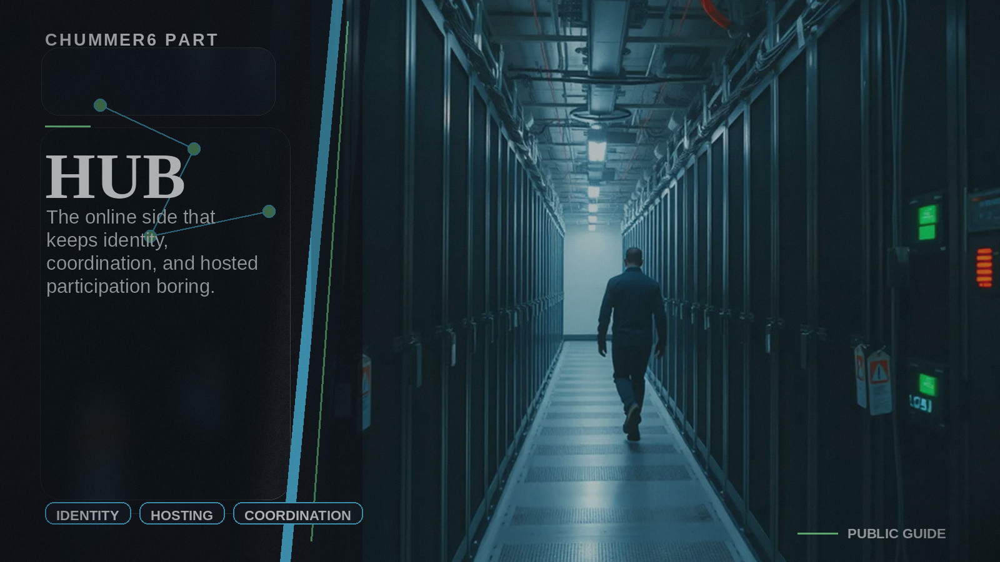

# Hub

The online side that keeps sign-in, coordination, and community features boring.

## When you care

You sign in, sync across devices, follow what is coming next, or use participation and recognition features.

## Why you care

It keeps accounts, shared coordination, and community features from turning into manual glue work.

## What it looks like

- sign-in and account pages
- groups, browser-openable invites, runner tickets, and GM roster controls
- Chronicle Studio drafts with separate source, upload, generation, publication, and sharing decisions
- public landing, home, and participation entry points
- account-aware home and account status for claim, participation, reward, and recovery
- shared coordination, release status, and recognition views that make sense without learning the plumbing behind them

## Limits today

- it is not the rules engine
- some deeper support and admin screens are still being simplified

## Current state

Hub already powers sign-in, landing and home views, participation, groups, runner-bound invite joins, and the reviewed Chronicle Studio record. Android consumes those account-scoped group and book contracts without giving the external writing provider authority over publication or campaign state.

## Go deeper

- [Current status](../NOW/current-status.md)
- [Where to go deeper](../WHERE_TO_GO_DEEPER.md)
