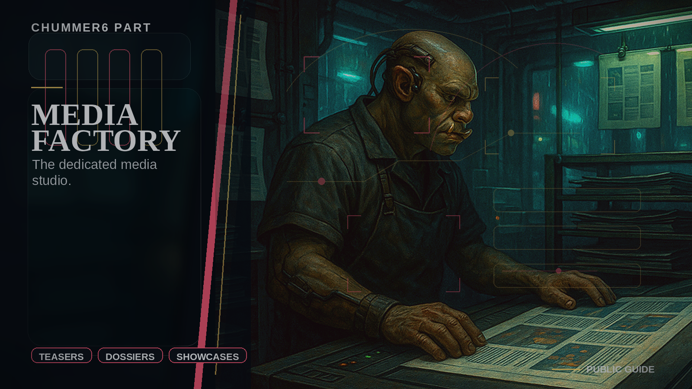

# Media Factory

The render-only asset plant.

## When you care

You care about finished images, teaser media, dossiers, narrated packets, or other polished outputs that still need provenance.

## Why you care

This is how the product can look finished without letting style quietly rewrite the facts.

## What you notice

- cleaner asset generation and preview flows
- a stronger line between content rendering and product meaning
- a path toward richer teaser and artifact media without turning every repo into a render farm

## Current limits

- this is not the decision-maker for what a session means
- it should stay render-only even when the outputs get more ambitious

## Current truth

Media Factory is the dedicated place for render jobs and asset lifecycle, and the current work is about making richer outputs possible without blurring provenance or ownership.

## Go deeper

- ../NOW/public-surfaces.md
- ../WHERE_TO_GO_DEEPER.md
