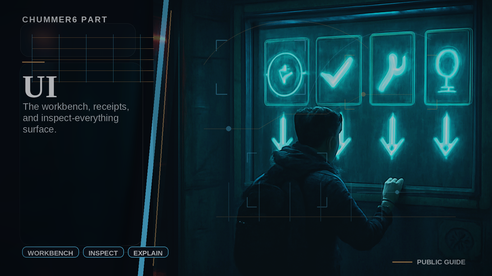

# UI

The workbench and inspect-everything surface.

## When you care

You want the heavy prep view, comparison tools, bigger inspectors, or the place where you stare at a build until it confesses.

## Why you care

This is where Chummer stops feeling mystical and starts feeling inspectable.

## What you notice

- bigger prep and review surfaces
- clearer build inspectors and comparison flows
- a stronger distinction between deep prep and live table use

## Current limits

- this is not the player-first live shell
- some workbench polish is still catching up to the cleaner split

## Current truth

UI is the prep-heavy head, and the current cleanup work is about keeping that power without quietly reclaiming play-first or hosted jobs.

## Go deeper

- ../START_HERE.md
- ../WHERE_TO_GO_DEEPER.md
