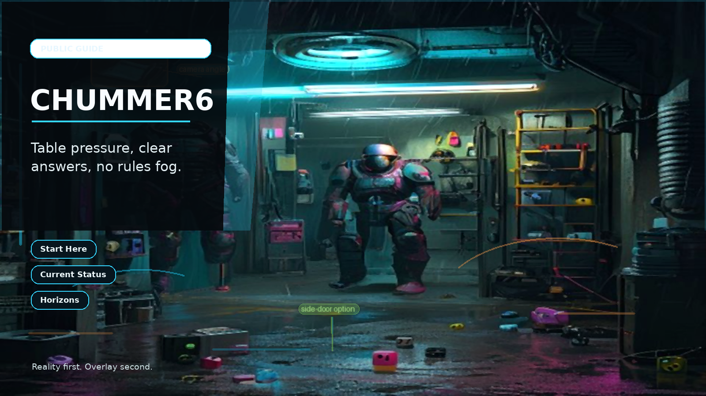

# Chummer Public Guide

This is the public guide to Chummer6.
Use it to see what works today, what is still preview, and where to go next.

## Product promise

Shadowrun rules truth, with receipts.

Build characters, inspect rulings, and keep sessions moving with explainable math, durable state, and clear proof of what works today.

- Public preview, honest status, and clear proof of what works today.

## What is real now

- Current stage: Public preview.
- The current Linux preview package is published on the public shelf.
- Help, privacy, terms, contact, and release guidance are live as first-party product pages.
- More campaign depth, broader platform coverage, and stronger proof trails are still opening next.

## First contact

## Start here

- [Start here](START_HERE.md)
- [Status](STATUS.md)
- [What Chummer6 Is](WHAT_CHUMMER6_IS.md)
- [How can I help](HOW_CAN_I_HELP.md)
- [Download](DOWNLOAD.md)
- [Help](HELP.md)
- [FAQ](FAQ.md)
- [Contact](CONTACT.md)
- [Parts index](PARTS/README.md)
- [Horizons index](HORIZONS/README.md)

## Product parts

- [Design](PARTS/design.md): The long-range product map and decision filter.
- [Core](PARTS/core.md): The deterministic rules engine.
- [UI](PARTS/ui.md): The workbench and inspect-everything surface.
- [Mobile](PARTS/mobile.md): The table-side companion you feel during play.
- [Hub](PARTS/hub.md): The online side that keeps sign-in, coordination, and community features boring.
- [UI Kit](PARTS/ui-kit.md): The shared visual vocabulary.
- [Hub Registry](PARTS/hub-registry.md): The release shelf, install record, and compatibility record.
- [Media Factory](PARTS/media-factory.md): The dedicated media studio.

## Get support

Use the first-party product path first: download help, account recovery, current release truth, and a real support intake before you fall through to deeper technical material.
