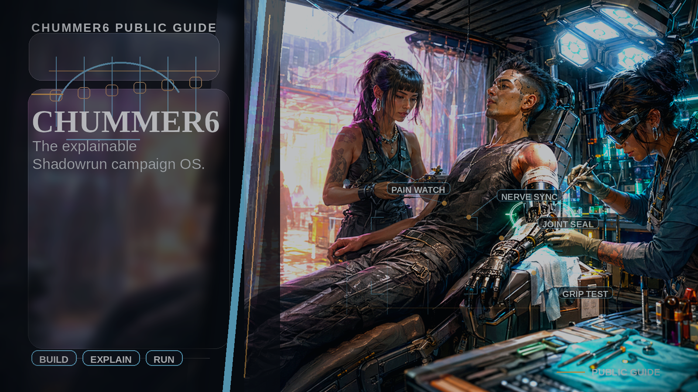

# Chummer6

Use this guide to answer the practical questions first: what Chummer6 is, what works today, what to download, and where to get help.

## Product promise

Chummer6 helps Shadowrun players and GMs build runners, explain rulings, and keep campaigns moving without mystery math.

Its first must-win job is being the most trustworthy way to build, inspect, and advance a Shadowrun character.

The goal is simple: build correctly, explain clearly, run reliably, recover calmly, and carry the campaign forward.

## What is real now

- Short answer: yes, as an early preview.
- Downloads are currently live for Windows.
- If you see both desktop apps, start with the Avalonia desktop app. Treat Blazor desktop app as a fallback path only when the download page or support explicitly tells you to use it.
- Use Avalonia first when the download page offers it.
- Character math is already solid. The rough edges are mostly installer polish, update polish, and support polish.
- Today: Usable preview.
- Still missing from the public download page: Linux and macOS.
- The current shelf should be read as a real preview, not a finished no-step-back release.
- Help, contact, privacy, and terms pages are live.
- More campaign-ledger depth and steadier desktop polish are still coming.

## Start here

- [Download builds](DOWNLOAD.md)
- [Status](STATUS.md)
- [Current status](NOW/current-status.md)
- [What Chummer6 Is](WHAT_CHUMMER6_IS.md)
- [Moving from Chummer5a](FROM_CHUMMER5A_TO_CHUMMER6.md)
- [How can I help](HOW_CAN_I_HELP.md)
- [Help](HELP.md)
- [FAQ](FAQ.md)
- [Contact](CONTACT.md)
- [Future ideas](HORIZONS/README.md)

## How can I help?

Use the public participation path when you want to report a problem, flag confusing guide copy, or suggest a future improvement.

- [Open the public participation page](https://chummer.run/participate)
- [File a public issue](https://github.com/ArchonMegalon/Chummer6/issues)
- Guided contribution is optional and still goes through review before anything lands.

## First contact

## Why people care

- It shows why a number changed instead of hiding the math.
- It is being built to keep sessions and campaigns recoverable when devices or connectivity drift.
- The status, downloads, and help story is meant to stay in plain sight instead of being scattered.

## Product parts

- [Parts index](PARTS/README.md): an inside view of how the app is put together.
- [Horizons index](HORIZONS/README.md): future ideas that are not ready today.

## Need help

Start here for downloads, sign-in recovery, and support.

- Start with [Help](HELP.md) if install, updates, sign-in, or bugs are getting in the way.
- Use [Contact](CONTACT.md) when you want to report a problem or send feedback.
